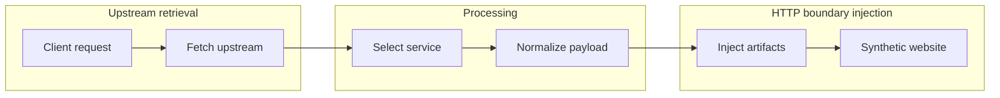
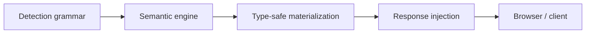

# Wapparalyser


<p align="center">
    <br>
    <i>Fuzzing 'n' Fooling Wappalyzer</i>
</p>

> Wapparalyser was presented at [BSides Delhi 2019](https://bsidesdelhi.in/).

Wapparalyser is a Python-based defensive security tool for blue-teams which defeats [Wappalyzer](https://www.wappalyzer.com/) (a common red-team tool that uncovers the technologies used on websites) by operating at the same layer as its detection engine.

Rather than blocking or obfuscating requests, it generates synthetic yet valid fingerprint artifacts that satisfy Wappalyzer's detection logic while remaining non-executable and safe.

To know more, you can head over to [My first security talk — BSides Delhi 2019 Experience](https://blog.0x48piraj.com/my-first-security-talk-bsides-delhi-2019-experience).

## History

Wapparalyser originally began as an experimental effort to understand and defeat Wappalyzer's detection mechanisms.

The first implementation was intentionally exploratory with rapid prototyping patterns, minimal structure and several partially implemented ideas living side-by-side in a single command-line codebase.

While the system worked and proved the core concept, its structure did not scale with complexity. Fuzzing logic, output generation, transport concerns and presentation were tightly coupled making the behavior difficult to reason about, test or extend.

This rewrite revisits the project with that original intent exploring multiple uncommitted abandoned prototypes and partial implementations. Shockingly, it still works like gangbusters in ~2022~ **2026**. Letting it gather dust would have been a crime.

## Features

- Emulating services
   * All
   * Random
   * Individual services or composite stacks (e.g. MEAN, LAMP, LAMB, DONKEY?)
- Signature-driven fuzzing engine
   * Blind
   * metadata | js | scripts | html | headers | cookies

➔ **Some additional features**

- No website modification or lengthy patches
- Simple user interface and several logging features
- Explicit modes: front-end, back-end & combined
- Emulates any service (currently, 1123)

## Architecture

At the core is a standalone fuzzing engine that:

* Consumes Wappalyzer detection rules
* Produces structured, technology-agnostic payloads
* Remains independent of framework concerns

These payloads are then passed through a normalization layer that converts detection rules into **safe, non-executable artifacts** followed by a response wrapper that applies service emulation strictly at HTTP and HTML boundaries.

The system follows a clean proxy flow:



This architecture allows the same engine to power:

* a CLI
* a web API
* a transparent HTTP proxy

without duplicating logic or violating security constraints.

Each stage has a single responsibility and operates on a well-defined boundary.



The pipeline is intentionally unidirectional; no stage mutates or reinterprets upstream content.

## Installation

Clone the repository and install dependencies in an isolated environment:

```bash
git clone https://github.com/0x48piraj/wapparalyser.git
cd wapparalyser

# Optional, recommended
python3 -m venv venv
source venv/bin/activate

pip install -r requirements.txt
```

## Usage

While you can use `src/wapparalyser/cli.py` to generate known artifacts and experiment with them in your own application, running the **Wapparalyser proxy web app** gives you the project's capabilities most effectively.

Start the Wapparalyser web application:

```bash
python3 src/web/app.py
```

The service will start on:

```
http://localhost:8005
```

This launches an HTTP proxy that injects **deceptive fingerprint artifacts** into outbound responses.

## Usage

Wapparalyser operates as a **response-shaping layer**: it fetches a real upstream site, injects synthetic technology fingerprints and returns a modified response to the client.

Run Wappalyzer against the proxy endpoint, not the original site.

The upstream site remains unchanged; everything occurs in-transit.

### A. Default (Random service emulation)

```text
http://localhost:8005/proxy
```

* Fetches the default upstream site (`example.com`)
* Applies a randomly selected technology fingerprint
* Returns a visually identical page with altered detection signals

### B. Force a specific service

```text
http://localhost:8005/proxy?service=Docker
```

* Forces the response to emulate a specific service
* Useful for testing individual fingerprints and detection behavior

### C. Proxy a different upstream website

```text
http://localhost:8005/proxy?target=https://httpbin.org/html&service=Nginx
```

* Proxies an arbitrary upstream site
* Applies the selected service emulation inline
* No modification to the original upstream content is required

### Listing available services

To view all supported services exposed by the engine:

```text
http://localhost:8005/api/services
```

### Notes

* No changes are made to the upstream server
* All injections are **non-executable and inert**
* Service emulation is applied at HTTP and HTML boundaries only
* Designed for controlled testing, research and blue-team analysis
