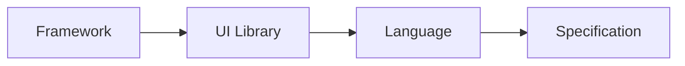
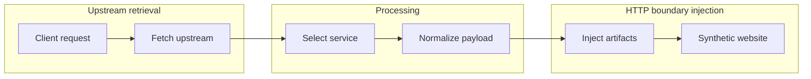
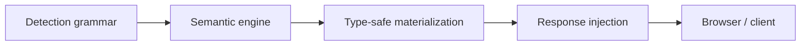

# Wapparalyser


<p align="center">
    <br>
    <i>Fuzzing 'n' Fooling Wappalyzer</i>
</p>

> Wapparalyser was presented at [BSides Delhi 2019](https://bsidesdelhi.in/).

Wapparalyser is a Python-based defensive security tool for blue-teams which defeats [Wappalyzer](https://www.wappalyzer.com/) (a common red-team tool that uncovers the technologies used on websites) by operating at the same layer as its detection engine.

Rather than blocking or obfuscating requests, it generates synthetic yet valid fingerprint artifacts that satisfy Wappalyzer's detection logic while remaining non-executable and safe.

The result is a transparent deception gateway that can convincingly present arbitrary technology stacks to scanners, browsers and automated tooling without modifying the origin site.

To know more, you can head over to [My first security talk — BSides Delhi 2019 Experience](https://blog.0x48piraj.com/my-first-security-talk-bsides-delhi-2019-experience).

## History

Wapparalyser originally began as an experimental effort to understand and defeat Wappalyzer's detection mechanisms.

The first implementation was intentionally exploratory with rapid prototyping patterns, minimal structure and several partially implemented ideas living side-by-side in a single command-line codebase.

While the system worked and proved the core concept, its structure did not scale with complexity. Fuzzing logic, output generation, transport concerns and presentation were tightly coupled making the behavior difficult to reason about, test or extend.

This rewrite revisits the project with that original intent exploring multiple uncommitted abandoned prototypes and partial implementations. Shockingly, it still works like gangbusters in ~2022~ **2026**. Letting it gather dust would have been a crime.

## Why this exists

Technology fingerprinting tools like Wappalyzer rely on:

* HTTP headers
* Cookies
* HTML patterns
* `<meta>` tags
* JavaScript stubs
* Script URLs

Rather than attempting to block or evade detection, it **speaks the same grammar** and generates fingerprints that look indistinguishable from real-world deployments.

This makes it useful for:

* Blue-team deception
* Red-team research
* Scanner testing
* CI/CD validation
* Defensive signal analysis
* Teaching how fingerprinting actually works


Wapparalyser does **not**:

* Patch upstream servers
* Inject executable JavaScript
* Rewrite application logic
* Modify application state

Instead, it:

* Synthesizes *only* the artifacts fingerprinting tools observe
* Injects them strictly at HTTP and HTML boundaries
* Keeps all injected content inert and non-invasive

## Features

- Stack-based service emulation
    * Emulate **individual services** _(currently, 1123)_
    * Emulate **composite stacks** (e.g. LAMP, MEAN, cloud edge stacks)
    * Combine arbitrary technologies
    * Merge headers, cookies, scripts, meta, JS globals safely

- Recursive implied technologies

Wappalyzer signatures often imply deeper stacks i.e.


Generally,



Wapparalyser can:

* Expand implied technologies recursively
* Preview implied stacks in the UI
* Optionally include them in emulation

This produces **multi-layer fingerprints** instead of shallow signals.

- Deterministic mode (seeded fuzzing)

All fuzzing is driven by regex materialization.

By supplying a seed, you can:

* reproduce fingerprints exactly
* share stack configurations
* keep CI and scripted runs stable

The same seed produces the same fingerprint across:

* Preview
* Proxy
* Exports

- Featured Web UI

The web application provides:

* Searchable service grid
* Interactive selection
* Multi-service stack composition
* Implied technology expansion
* Deterministic seed input
* Live fingerprint preview
* One-click proxy launch
* nginx / Caddy config export
* Stack presets

- Transparent HTTP proxy

Wapparalyser operates as a **response-shaping proxy**:

1. Fetches an upstream website
2. Generates a synthetic fingerprint
3. Injects artifacts safely
4. Returns a visually identical response

The upstream site is never modified.

- Headless proxy mode

For automation and tooling, Wapparalyser can run without UI:

* no templates
* no JavaScript
* only `/proxy` exposed

Perfect for:

* CI pipelines
* scripted deception
* red-team infra
* chaining with curl, mitmproxy, Burp

## Architecture

At the core is a standalone fuzzing engine that:

* Consumes Wappalyzer detection rules
* Produces structured, technology-agnostic payloads
* Remains independent of framework concerns

These payloads are then passed through a normalization layer that converts detection rules into **safe, non-executable artifacts** followed by a response wrapper that applies service emulation strictly at HTTP and HTML boundaries.

The system follows a clean proxy flow:



This architecture allows the same engine to power:

* a CLI
* a web API
* a transparent HTTP proxy

without duplicating logic or violating security constraints.

Each stage has a single responsibility and operates on a well-defined boundary.



The pipeline is intentionally unidirectional; no stage mutates or reinterprets upstream content.

## Installation

Clone the repository and install dependencies in an isolated environment:

```bash
git clone https://github.com/0x48piraj/wapparalyser.git
cd wapparalyser

# Optional, recommended
python3 -m venv venv
source venv/bin/activate

pip install -r requirements.txt
```

## Usage

While you can use `src/wapparalyser/cli.py` to generate known artifacts and experiment with them in your own application, running the **Wapparalyser proxy web app** gives you the project's capabilities most effectively.

Start the Wapparalyser web application:

```bash
python3 src/web/app.py
```

The service will start on:

```
http://localhost:8005
```

This launches an HTTP proxy that injects **deceptive fingerprint artifacts** into outbound responses.

## Usage

Wapparalyser operates as a **response-shaping layer**: it fetches a real upstream site, injects synthetic technology fingerprints and returns a modified response to the client.

Run Wappalyzer **against the proxy endpoint**, not the original site.

The upstream site remains unchanged; everything occurs in-transit.

## API overview

### List services

```http
GET /api/services
```

Returns:

* name
* icon
* categories
* implied technologies

### Emulate a stack

```http
POST /api/emulate
```

```json
{
  "services": ["Nginx", "PHP", "WordPress"],
  "expand_implies": true,
  "seed": 1337
}
```

Returns a normalized fingerprint preview.

### Export configs

```http
POST /api/export/nginx
POST /api/export/caddy
```

Generates ready-to-use header injection snippets for proxy setups.

## Proxy usage

### Basic

```text
http://localhost:8005/proxy
```

* random stack
* default upstream (`example.com`)

### Specific stack

```text
http://localhost:8005/proxy?services=Nginx,PHP,WordPress
```

### Example

```text
http://localhost:8005/proxy
  ?target=https://example.com
  &services=Nginx,PHP,WordPress
  &expand_implies=1
  &seed=1337
```

> **Note:** Run Wappalyzer **against the proxy**, not the origin.

## Headless proxy mode

Perfect for:

* CI
* Red team infra
* Scripted runs
* Chaining with mitmproxy / burp / curl

Only `/proxy` is exposed.
No UI. No templates. No JS.

Run,

```bash
WAPPARALYSER_HEADLESS=1 python3 src/web/app.py
```

#### Example

```bash
http://localhost:8005/proxy?target=https://example.com&services=nginx,php&seed=1337
```

## Notes

* No executable JavaScript is injected
* No upstream websites / servers are modified
* All artifacts are inert
* Designed for research, testing and controlled environments

## Roadmap & Future work

Wapparalyser intentionally focuses on semantic fingerprint synthesis and safe deception not total traffic interception or browser automation.

The roadmap below captures both what has been completed and what could be explored next without committing to unnecessary complexity.

### Completed capabilities

#### Multi-service stack emulation

Wapparalyser supports composing realistic technology stacks rather than isolated services.

* Display and manage multiple selected services
* Recursively expand implied technologies
* Preview base vs implied stack layers in the UI
* Apply complete stack composition consistently across preview, proxy and exports

This enables accurate emulation of real-world deployments (frameworks, runtimes, platforms).

#### Deterministic fingerprints

Fingerprint generation can be made completely reproducible.

* Seed-driven regex materialization
* Identical fingerprints across preview, proxy and exports
* Shareable and repeatable configurations

This is critical for CI pipelines, demos and controlled research environments.

#### Stack persistence & export

Stack configurations can be preserved and reused.

* Save and reload stack presets in the browser (localStorage)
* Export header configurations for nginx and Caddy
* Maintain consistency across sessions without backend state

These features improve ergonomics without coupling UI state to the engine.

### Future exploration

#### HAR-style session export

Capture a complete proxied browsing session in a portable archive.

* Headers, cookies, injected artifacts
* Response bodies and timings
* Redirect chains

**Benefits:** Provides an exact record of how deception appeared to scanners and browsers.

**Trade-offs:** Requires total request/response interception, buffering and session correlation, significantly increasing complexity and attack surface.

#### Fingerprint diffing

Compare two generated fingerprints to highlight meaningful differences.

* Headers, cookies, meta tags
* Script URLs and JS globals
* Stack composition changes

**Benefits:** Useful for research, demos and explaining *why* a fingerprint triggered detection.

**Scope note:**
Can be implemented as a standalone analytical tool without impacting proxy behavior.

### Philosophy going forward

Not every feature belongs in Wapparalyser.

Future additions should:

* Reinforce understanding of fingerprinting behavior
* Preserve strict safety guarantees
* Avoid turning the proxy into a complete traffic MITM
* Keep the engine framework-agnostic

The project favors **clarity and correctness** over breadth.
